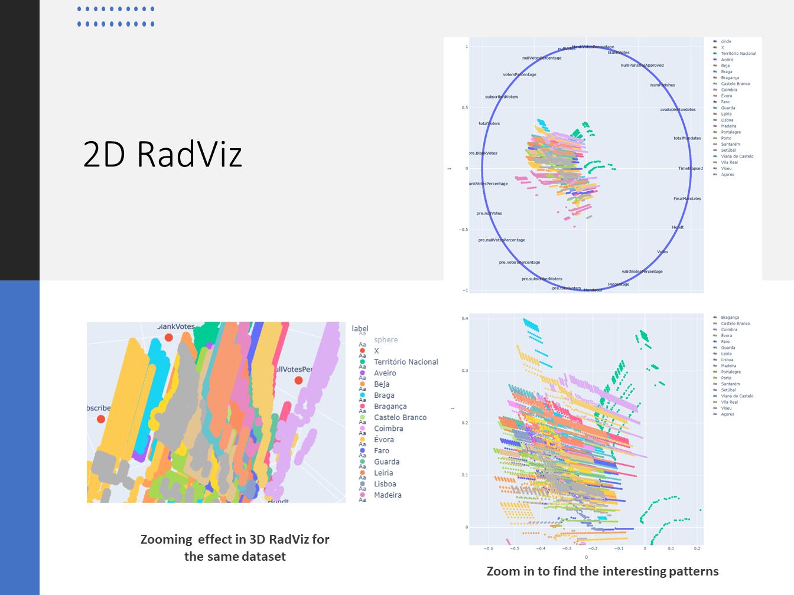
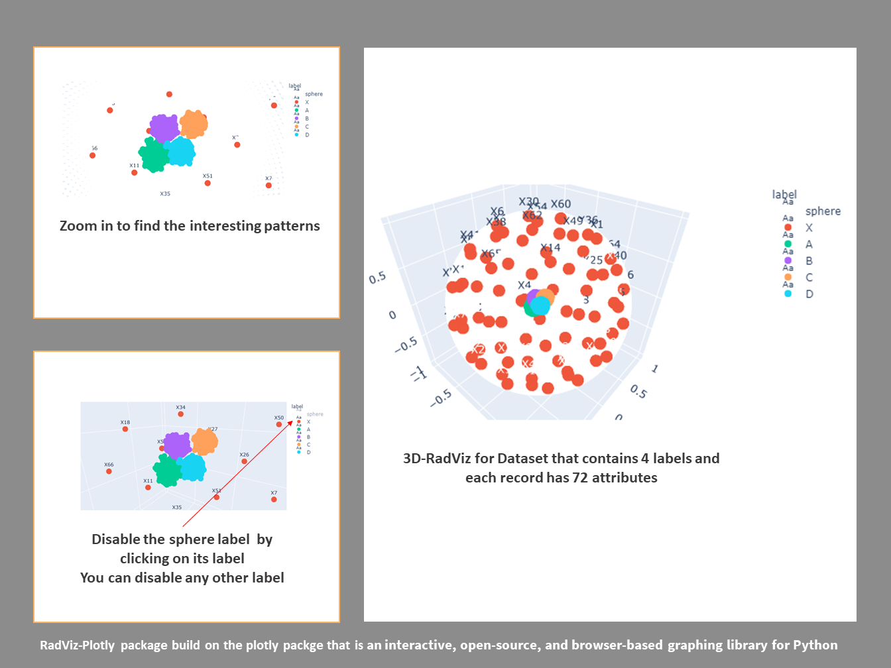

# RadViz-Plotly

<table>
    <tr>
        <td>Latest Release</td>
        <td>
            <a href="https://pypi.org/project/RadViz-Plotly/"/>
            
        </td>
    </tr>
    <tr>
        <td>Examples</td>
        <td>
            <a href="https://badge.fury.io/gh/elewah%2FRadViz-Plotly-Examples">
            </a>
        </td>
    </tr>
    <tr>
        <td>PyPI Downloads</td>
        <td>
            <a href="https://pepy.tech/project/RadViz-Plotly"/>
            
        </td>
    </tr>
    <tr>
        <td>License</td>
        <td>
            <a href="https://opensource.org/licenses/MIT"/>
            
        </td>
    </tr>
</table>

## Short Description 
The Radviz-Plotly package has two functions, 2DRadViz that plots the 2D Radial visualization and 3DRadViz that plots Radial visualization, using the powerful interactive tools in Plotly library.


## Quickstart 
### Without Locally Installation
Try the RadViz-Plotly package**without locally Installation
Follow these steps**</br>
1- click this link [here](https://mybinder.org/v2/gh/elewah/RadViz-Plotly-Examples/master). It's a collection of interactive Jupyter notebooks  that contains three folders. Each folder contains Dataset and a Jupyter file that use RadViz-Plotly.</br>
**Hint:**  sometimes this link takes a long time to open as jupyter's environment.</br>
2- After the jupyter environment comes out, open Car Evaluation Dataset, Election Dataset, or Iris Dataset folder.  </br>
3- Open file with extension **.ipynb** (the jupyter file)</br>
4- After the jypyter file loading, from the **cell** list on the toolbar click **Run All** </br>
**Hints:**  </br>
A- At the first running time, it takes time to install the dependences.</br>
B- This is an interactive RadViz package where you can make zoom, fillter lables, and rotate the 3D graph </br>
C- This packge depends on the [plotly.py](https://plot.ly/python) packge</br>
### With Locally Installation
 
1-install **RadViz Plotly** using this command</br>
```pip install RadViz-Plotly```
</br>
2- Download examples repository using this command </br>
```git clone  https://github.com/elewah/RadViz-Plotly-Examples.git``` </br>
or Download by clicking [here](https://github.com/elewah/RadViz-Plotly-Examples/archive/master.zip) </br>
3- Run these examples using jupyter labs to understand how to use RadViz-Plotly package

---
## Gallary
<p align="center">
  
  
</p>

## About
The RadViz-Plotly is developed by a research group on the IoT lab at Ontario tech university. The Radviz-Plotly package has two functions, 2DRadViz that plots the 2D Radial visualization and 3DRadViz that plots Radial visualization, using the powerful interactive tools in Plotly library.

## Contact Us
 **Email:** abdelrahman.elewah@ontariotechu.net
 
## Copyright and Licenses

Code released under the [MIT license](LICENSE).


